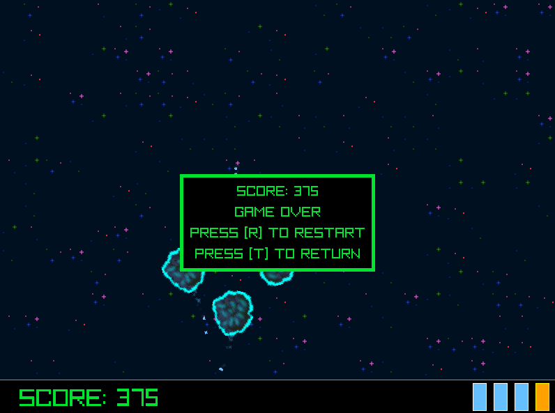

## COSMIC PURSUIT

### Description

My first ever game jam submission, a simple space shooter game based on Asteroids made for the "Raylib Slo Jam".

### Features

Portals will appear to summon asteroids you must destroy using your ship's built in lasers. The asteroids can be covered in metal that you can melt using the flamethrower or have a shield that you need to remove using the electric pulse.

### Controls

Keyboard:
 - \[W\] to move ship forward
 - \[A\] to rotate ship counterclockwise
 - \[S\] to move ship backwards
 - \[D\] to rotate ship clockwise
 - \[J\] to fire lasers
 - \[K\] to use flamethrower
 - \[L\] to use electric shock

### Screenshots

### Developers

 - Turp2703 (myself) - Everything
 
### Links

 - itch.io Release: https://turp2703.itch.io/cosmic-pursuit

### License

This game sources are licensed under an unmodified zlib/libpng license, which is an OSI-certified, BSD-like license that allows static linking with closed source software. Check [LICENSE](LICENSE) for further details.

*Copyright (c) 2024 Turp2703*